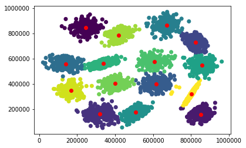

# KMeans ++
This is an Implementation of the KMeans ++ algorithim. the included file KMeans.py includes a class that clusters the data then plots the resulting clusters.


```python
import numpy as np
import matplotlib.pylab as plt
from KMeans import KMeans
```

    /home/mostafakm/miniconda3/lib/python3.7/site-packages/matplotlib/figure.py:457: UserWarning: matplotlib is currently using a non-GUI backend, so cannot show the figure
      "matplotlib is currently using a non-GUI backend, "


```python
from sklearn.datasets import make_blobs
X,y = make_blobs(centers=4, n_samples=500, random_state=0, cluster_std=0.7)
class_ = KMeans(X, 4, iterations = 5)
class_.train()
```


```python
data=np.loadtxt("s1.txt")
class_ = KMeans(data, 15, iterations = 10)
class_.train()
```





```python
data=np.loadtxt("s3.txt")
class_ = KMeans(data, 15)
class_.train()
```


