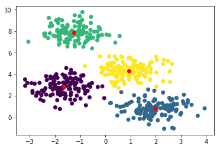

# Demo of KMeans Algorithm Implementation


```python
import numpy as np
import matplotlib.pylab as plt
from KMeans import KMeans
```


```python
from sklearn.datasets import make_blobs
X,y = make_blobs(centers=4, n_samples=500, random_state=0, cluster_std=0.7)
class_ = KMeans(X, 4, iterations = 500)
class_.train()
```

    /home/mostafakm/miniconda3/lib/python3.7/site-packages/matplotlib/figure.py:457: UserWarning: matplotlib is currently using a non-GUI backend, so cannot show the figure
      "matplotlib is currently using a non-GUI backend, "




